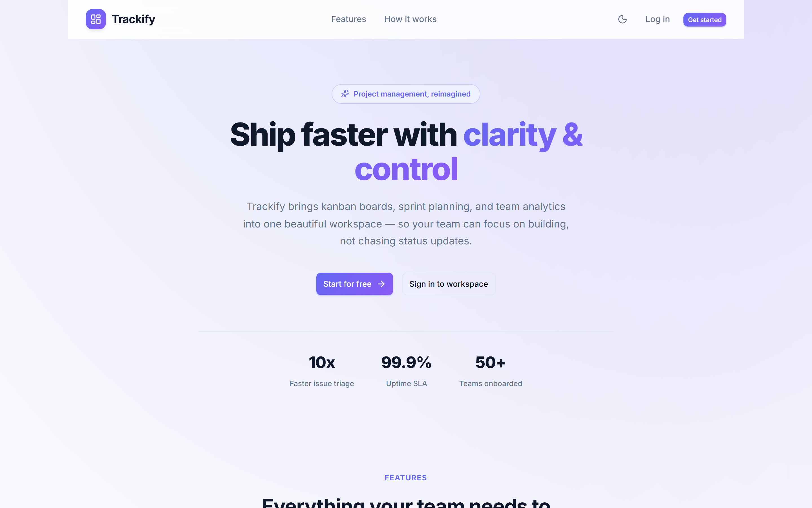
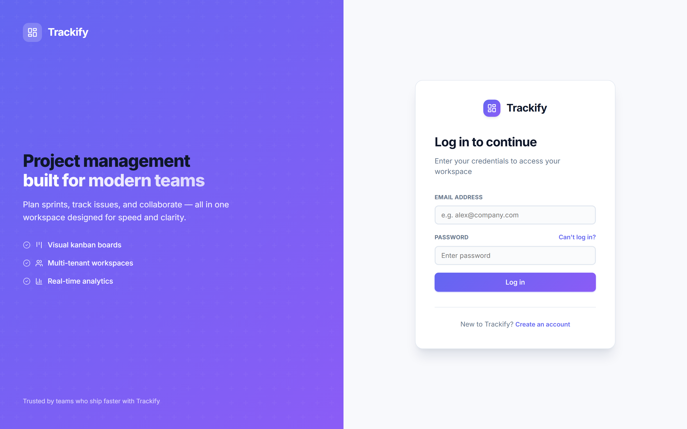
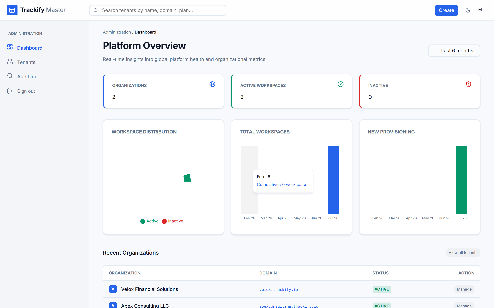
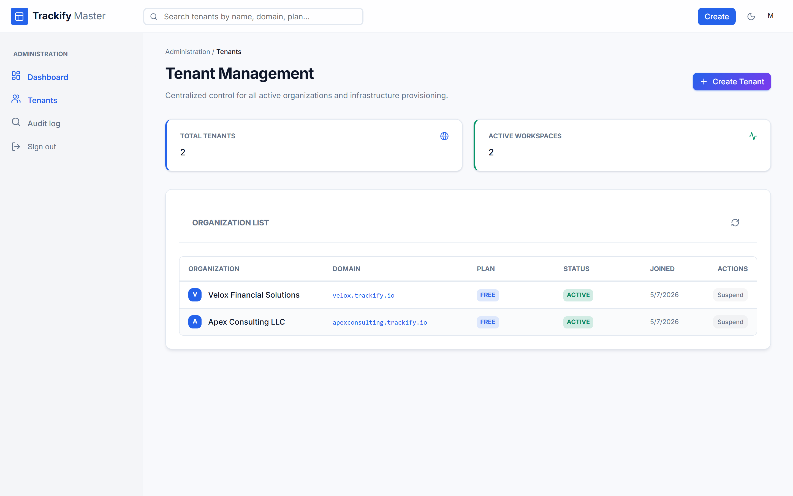
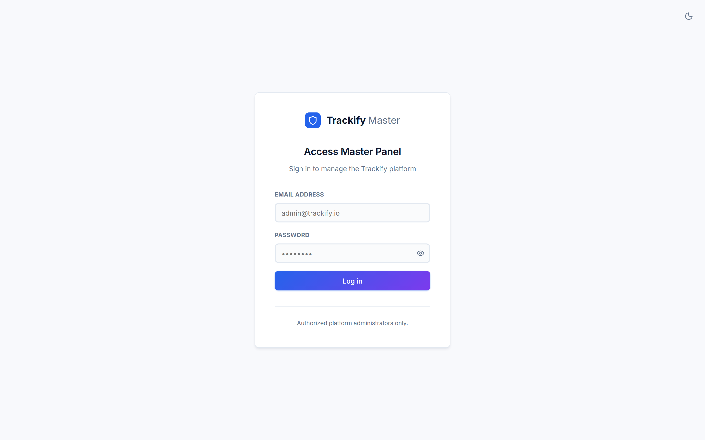

# Trackify

Multi-tenant project and issue management for organizations that need isolated workspaces.

Trackify combines a Spring Boot microservice backend with two React apps: a **master** console for platform operators, and a **tenant** workspace for day-to-day project work (Kanban, sprints, notifications).

[](https://github.com/ashwani-labs/trackify-saas-platform/actions/workflows/ci.yml)
[](./LICENSE)
[](https://openjdk.org/)
[](https://spring.io/projects/spring-boot)
[](https://react.dev/)



## Highlights

- **Database-per-tenant isolation** — each organization gets its own MySQL database
- **Dual frontends** — platform admin (`master-app`) and workspace UI (`tenant-app`)
- **API gateway** — JWT validation, rate limiting, and a single public entry point
- **Shared design system** — `@trackify/shared` components and theme tokens
- **Ops-ready** — Flyway on the master DB, OpenAPI/Swagger, health probes, optional S3 attachments

## Features

| Area | Capabilities |
|------|----------------|
| Platform admin | Tenant provisioning, plan/status, growth dashboard, platform audit log |
| Auth | JWT login (master + tenant), password reset/change, profile photos |
| Team | Self-registration with admin approval, invites, role-based access |
| Projects | CRUD, members, activity feed |
| Issues | Kanban board, comments, attachments, filters, CSV export |
| Sprints | Backlog, sprint planning, burndown |
| Notifications | In-app bell + SSE; optional SMTP via `notification-service` |
| Branding | Per-tenant theme presets |

## Tech stack

| Layer | Stack |
|-------|--------|
| Backend | Java 17, Spring Boot 3.3, MySQL 8, JWT (JJWT), Flyway, Bucket4j |
| Frontend | React 19, Vite 8, Redux Toolkit, React Router 7, Vitest |
| Shared | `@trackify/shared` design system (npm workspaces) |
| CI | GitHub Actions (Maven tests + frontend lint/test/build) |

## Architecture

```text
Browser
  ├── master-app  (:5173)
  └── tenant-app  (:5174)
           │
           ▼
     api-gateway (:8080)
           ├── auth-service          (:8081)  → trackify_master
           ├── tenant-service        (:8082)  → trackify_master + tenant DBs
           ├── project-service       (:8083)  → per-tenant MySQL
           └── notification-service  (:8084)  ← optional (SMTP / console)
```

| Service | Port | Responsibility |
|---------|------|----------------|
| `api-gateway` | 8080 | Reverse proxy, JWT gate, rate limit, Swagger |
| `auth-service` | 8081 | Login, tokens, master Flyway schema |
| `tenant-service` | 8082 | Org CRUD, DB provisioning, users, branding |
| `project-service` | 8083 | Projects, issues, sprints, in-app notifications |
| `notification-service` | 8084 | Email delivery |
| `common-lib` | — | Shared JWT, DTOs, exceptions, email client |

Deeper design notes: [docs/ARCHITECTURE.md](./docs/ARCHITECTURE.md)

## Repository layout

```text
trackify-saas-platform/
├── Backend/                 # Maven multi-module Spring Boot services
│   ├── api-gateway/
│   ├── auth-service/
│   ├── tenant-service/
│   ├── project-service/
│   ├── notification-service/
│   └── common-lib/
├── Frontend/                # npm workspaces
│   ├── master-app/          # Platform admin UI
│   ├── tenant-app/          # Workspace / marketing UI
│   └── packages/trackify-shared/
├── docs/                    # Setup, architecture, API, deployment
├── .env.example
├── LICENSE
└── README.md
```

## Prerequisites

| Tool | Version |
|------|---------|
| JDK | 17 |
| Maven | 3.9+ |
| Node.js | 20+ |
| MySQL | 8.x on `localhost:3306` |

## Quick start

Full walkthrough: **[docs/SETUP.md](./docs/SETUP.md)**

```bash
# 1. Environment
cp .env.example .env
# Edit JWT_SECRET and MySQL credentials

# 2. Backend shared library
cd Backend && mvn -pl common-lib install

# 3. Start services (separate terminals, in order)
mvn -pl auth-service -am spring-boot:run          # :8081
mvn -pl tenant-service -am spring-boot:run        # :8082
mvn -pl project-service -am spring-boot:run       # :8083
mvn -pl api-gateway -am spring-boot:run           # :8080
# optional: mvn -pl notification-service -am spring-boot:run

# 4. Frontend
cd Frontend && npm install
npm run dev:tenant    # http://localhost:5174
npm run dev:master    # http://localhost:5173
```

| App | URL | Default credentials |
|-----|-----|---------------------|
| Master | http://localhost:5173 | `master@trackify.com` / `admin123` |
| Tenant | http://localhost:5174 | Set when you provision a tenant |
| Gateway / Swagger | http://localhost:8080/swagger-ui.html | — |

## Configuration

Copy [`.env.example`](./.env.example) to `.env` at the **repo root**. Backend services import it automatically; Vite apps load `VITE_*` from the same file.

| Variable | Required | Purpose |
|----------|----------|---------|
| `JWT_SECRET` | Yes | Shared signing secret (32+ chars) |
| `INTERNAL_API_KEY` | Yes | Service-to-service calls |
| `SPRING_DATASOURCE_USERNAME` / `PASSWORD` | Yes | MySQL access |
| `VITE_API_BASE_URL` | Yes | Frontend → gateway (`http://localhost:8080`) |
| `MAIL_*` | No | SMTP; unset → console logging |
| `STORAGE_PROVIDER` | No | `local` (default) or `s3` |

See [.env.example](./.env.example) for the full list.

## Development

```bash
# Backend unit tests
cd Backend && mvn -B test

# Frontend
cd Frontend
npm run lint
npm run test
npm run format:check
npm run build
```

| Script | Description |
|--------|-------------|
| `npm run dev:tenant` | Tenant app on :5174 |
| `npm run dev:master` | Master app on :5173 |
| `npm run build` | Production builds for both apps |
| `npm run lint` | ESLint |
| `npm run test` | Vitest (both apps + shared package) |
| `npm run format` | Prettier write |

## Production build

```bash
# Backend JARs
cd Backend
mvn -pl api-gateway,auth-service,tenant-service,project-service,notification-service -am package -DskipTests

# Frontend static assets
cd Frontend && npm ci && npm run build
# Output: Frontend/tenant-app/dist, Frontend/master-app/dist
```

Deployment notes: [docs/DEPLOYMENT.md](./docs/DEPLOYMENT.md)

## Screenshots

| Tenant landing | Tenant login |
|----------------|--------------|
|  |  |

| Master dashboard | Tenant management |
|------------------|-------------------|
|  |  |

| Master login |
|--------------|
|  |

## API documentation

Interactive OpenAPI UI (with the gateway running):

http://localhost:8080/swagger-ui.html

Endpoint overview: [docs/API.md](./docs/API.md)

## Contributing

See [docs/CONTRIBUTING.md](./docs/CONTRIBUTING.md). Short version: keep changes focused, match existing style (Spotless / Prettier), and add tests for non-trivial logic.

## License

[MIT](./LICENSE) © 2026 Ashwani Sharma

## Acknowledgements

- Spring Boot, Spring Security, Flyway
- React, Vite, Redux Toolkit, Lucide
- Bucket4j, springdoc-openapi, JJWT

## Roadmap

- [ ] Stripe (or similar) billing for tenant plans
- [ ] Master-user impersonation for support
- [ ] Docker Compose one-command local stack
- [ ] Integration / E2E test suite (Testcontainers + Playwright)
- [ ] Spring Cloud Gateway migration (optional)

## Troubleshooting

| Problem | Fix |
|---------|-----|
| JWT / 401 errors | Same `JWT_SECRET` on every backend service; restart all |
| MySQL connection refused | Start MySQL on `3306`; check `.env` credentials |
| Frontend cannot reach API | `VITE_API_BASE_URL=http://localhost:8080` in root `.env`; restart Vite |
| Tenant admin password unknown | Check notification-service logs, or set `TRACKIFY_DEV_FIXED_ADMIN_PASSWORD` |
| Legacy tenant schema errors | Restart `project-service` (`TenantSchemaUpgrader`) |
| Theme columns missing | Restart `auth-service` so Flyway `V2` runs |
| Emails not sent | Start `notification-service`; configure `MAIL_*` or read console logs |

More detail: [docs/SETUP.md](./docs/SETUP.md#troubleshooting)

## FAQ

**Why two React apps?**  
Platform operators and workspace users have different auth contexts and UX. Splitting them keeps routing, tokens, and permissions clear.

**Where is tenant data stored?**  
In a dedicated MySQL database per organization (`trackify_tenant_<code>`), provisioned by `tenant-service`.

**Do I need notification-service locally?**  
No. Without it, email calls fail softly and are logged. In-app notifications still work via `project-service`.

**Is there Docker support?**  
Not yet. Services run via Maven / Vite. Compose is on the roadmap — see [docs/DEPLOYMENT.md](./docs/DEPLOYMENT.md).
